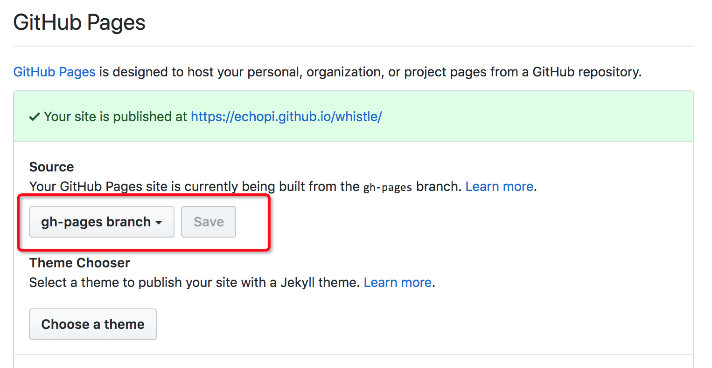

# whistle gh-pages

主要介绍如何自动化部署 gitbook 的资源到项目的 gh-pages，以 whistle 为例，其他项目思路一样。

## 基本思路

利用 github 的 webhook 机制，可以设置某个事件触发后调用一个远程 API。照这个思路，如果在某一台服务器部署一个服务，调用 API 即执行相关的脚本，将 gitbook 生成的静态资源 push 到远程 gh-pages 分支，就可以实现自动部署文档到 github。

脚本参考：https://github.com/echopi/whistle/blob/master/docs/script/build-book.sh

## 前提

提供 API 的应用需要有能力 push 代码到远程分支

## 步骤

### 步骤一：

远程主机部署服务

```sh
# 添加一个 node 普通用户，用户名字不重要
useradd node

# 设置密码 hello1234
passwd node

su - node

git clone https://github.com/echopi/whistle-gh-pages.git ～/whistle

npm i --registry=https://registry.npm.taobao.org
node . &
```

服务部署后，默认端口 6001，以及编译 gitbook 文档的 API: `ip:6001/api/whistle/build`

### 步骤二：

1. 在远程主机，pull 项目的代码到 ~/$PROJECT_NAME

  ```sh
  git clone https://github.com/avwo/whistle.git ~/whistle
  ```
2. 设置 ssh 到 github，参考：https://help.github.com/articles/generating-a-new-ssh-key-and-adding-it-to-the-ssh-agent/#platform-linux
3. 项目提供编译脚本，路径 `docs/script/build-book.sh`

```sh
# test ssh
ssh -T git@github.com
```

### 步骤三：

设置项目的 gh-pages 通过 `gh-pages` 分支编译



### 步骤四：

在项目下设置 webhook，调用远程 API

## API 说明

| API | method | 说明 |
|----------|----------|----------|
| `/api/whistle/build`   |  GET   | 201: 创建异步任务 <br/>404: `docs/script/build-book.sh` 脚本不存在 <br/> 500: spawn error |
| `/app.log`      | GET      |  app log |
| `/`      | GET      |  'Hello Koa' |

## 用户权限及防火墙问题

```sh
useradd node
chown -R node: ~/logs/whistle-gh-pages
chown -R node: ~/whistle

firewall-cmd --zone=public --add-port=6001/tcp --permanent
firewall-cmd --reload
```

## 其他问题

1. [升级 git](https://stackoverflow.com/questions/21820715/how-to-install-latest-version-of-git-on-centos-7-x-6-x)
2. [Push to github without password using ssh-key](https://stackoverflow.com/questions/14762034/push-to-github-without-password-using-ssh-key)
